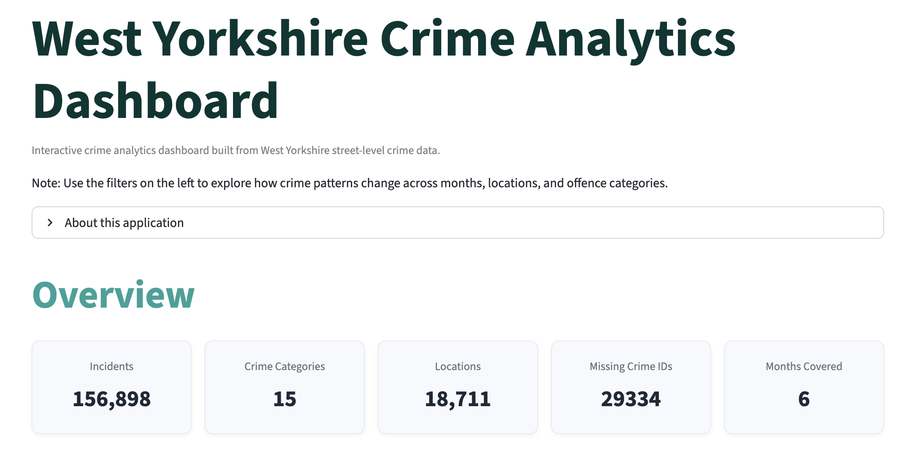
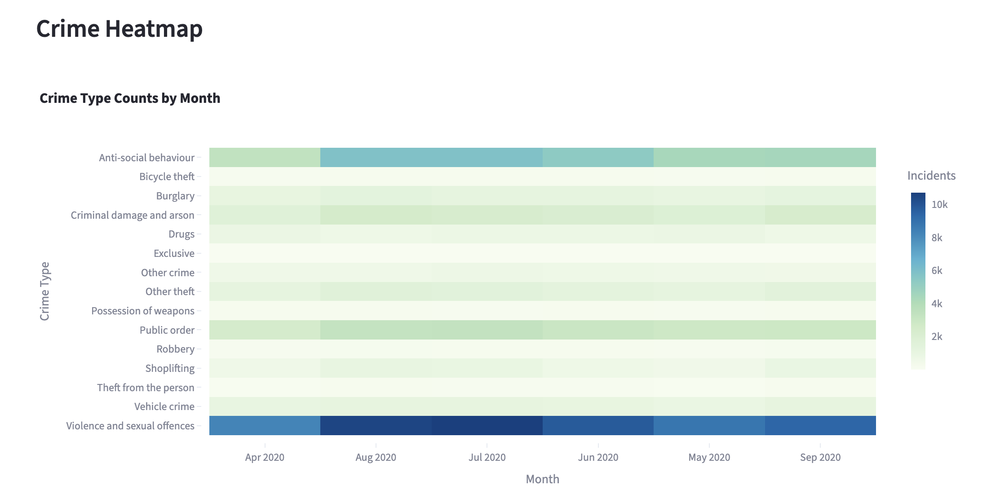
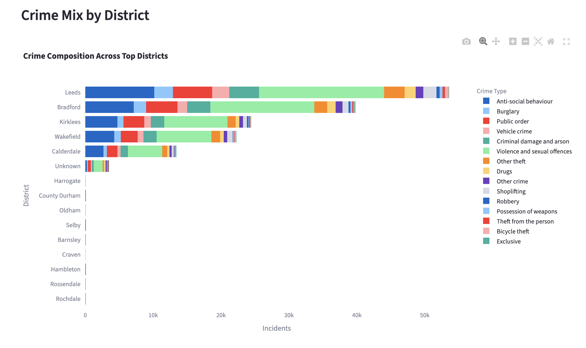
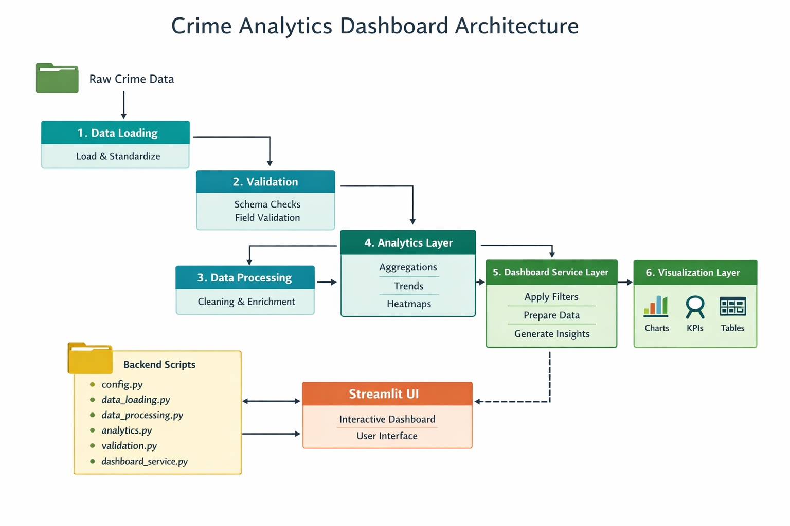

# Crime Analytics Dashboard for Policing Data

Interactive analytics dashboard for exploring crime patterns using
publicly available police incident data. The application enables
analysts to investigate trends, crime distributions, location-based
patterns, and data quality indicators through an intuitive Streamlit
interface.

This project demonstrates a **modular analytics architecture**,
combining data processing pipelines, analytical transformations, and a
production-style dashboard interface.

------------------------------------------------------------------------

## Project Motivation

This project demonstrates how modern analytics tools can support
**evidence-based policing and crime analysis**.

Analysts in public safety environments must be able to:

-   identify crime patterns
-   investigate spatial trends
-   evaluate outcomes
-   monitor operational data quality
-   communicate insights to decision makers

The dashboard architecture reflects how analytical systems are
structured in real-world public sector analytics environments.

---

## Live Application

**Streamlit App**

https://crime-analytics-policing.streamlit.app

**GitHub Repository**

https://github.com/toluwaniosabiya/crime-analytics-policing

------------------------------------------------------------------------

## Overview

The dashboard allows users to explore crime data through multiple
analytical lenses:

-   Overall incident metrics
-   Crime category distribution
-   Monthly crime trends
-   Crime heatmaps by type and time
-   Outcome distribution
-   High-incident locations and districts
-   Crime composition across districts
-   Data quality diagnostics
-   Interactive filtering and dataset exploration

The application is designed to simulate how **crime and intelligence
analysts** might explore operational data to support tactical or
strategic policing decisions.

------------------------------------------------------------------------

## How to Use the Dashboard
Choose months → filter crime types/districts → inspect trends and district composition.

---

## Dashboard Preview

Overview KPIs,

Temporal crime intensity heatmap

District-level crime mix

------------------------------------------------------------------------

## Key Features

### Interactive Filters

Users can dynamically filter the dataset by:

-   Month
-   Crime type
-   Outcome category
-   District

All visualizations update instantly based on the selected filters.

------------------------------------------------------------------------

### Analytical Visualizations

The dashboard provides multiple analytical views.

#### Overview Metrics

-   Total incidents
-   Unique crime categories
-   Unique locations
-   Missing Crime IDs
-   Months covered

#### Crime Distribution

-   Incident counts by crime category
-   Monthly incident totals

#### Trend Analysis

-   Monthly trend by crime type
-   Heatmap of crime intensity across months

#### Location Insights

-   Top locations with the highest incident counts
-   Outcome category distribution
-   Top districts
-   Crime mix by district

#### Analytical Insights

-   Automatically generated key observations
-   Data quality metrics

#### Filtered Dataset

Users can inspect the dataset underlying the visualizations.

------------------------------------------------------------------------

## Project Architecture

The application follows a modular architecture separating data
ingestion, transformation, analytics logic, and presentation.

### Architecture Principles

-   Modular design
-   Separation of concerns
-   Reusable analytics functions
-   Clear data pipeline
-   Scalable structure for additional analytics modules

------------------------------------------------------------------------

## Data Processing Pipeline

The project follows a reproducible data pipeline:

### 1. Data Loading

Raw crime datasets are imported and standardized.

### 2. Validation

Schema validation ensures required columns are present.

### 3. Data Processing

Processing includes:

-   Data cleaning
-   Coordinate corrections
-   Feature engineering
-   District extraction

### 4. Analytics Layer

Analytical computations include:

-   Crime distribution metrics
-   Monthly trend aggregation
-   Heatmap matrices
-   Location-level summaries
-   Outcome analysis

### 5. Dashboard Service Layer

The service layer orchestrates:

-   filter application
-   analytical computations
-   chart-ready datasets

### 6. Visualization Layer

Streamlit components render:

-   charts
-   KPI metrics
-   insights
-   tables

------------------------------------------------------------------------

## Technologies Used

### Programming

Python

### Data Processing

Pandas\
NumPy

### Visualization

Plotly\
Streamlit

### Development Tools

Git\
GitHub\
VS Code

------------------------------------------------------------------------

## Running the Project Locally

### Clone the repository

git clone
https://github.com/toluwaniosabiya/crime-analytics-policing.git\

cd crime-analytics-policing

### Create a virtual environment

python -m venv venv\
source venv/bin/activate

### Install dependencies

pip install -r requirements.txt

### Run the Streamlit app

streamlit run streamlit_app.py

The dashboard will open in your browser.

------------------------------------------------------------------------

## Future Enhancements

Potential extensions include:

-   geographic crime mapping
-   clustering of crime hotspots
-   anomaly detection for emerging crime spikes
-   predictive crime modeling
-   integration with police open data APIs

------------------------------------------------------------------------

## Author

**Toluwani Osabiya**

Data Scientist \| Health & Public Sector Analytics

GitHub\
https://github.com/toluwaniosabiya